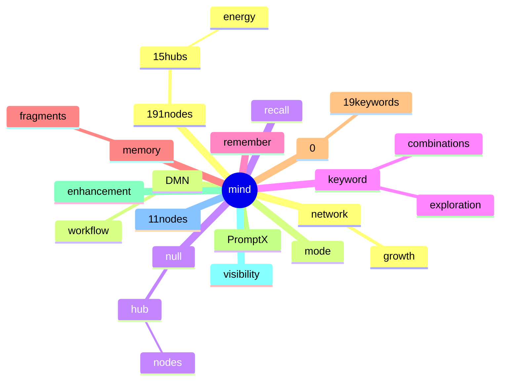
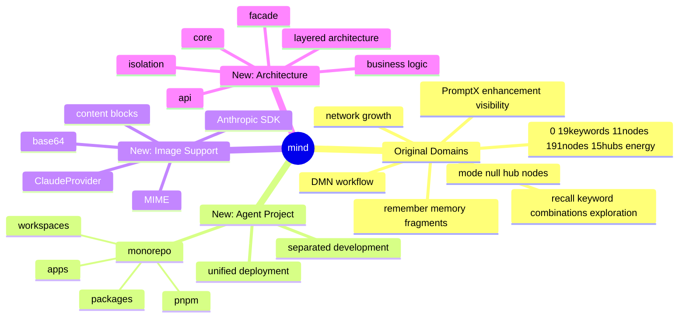
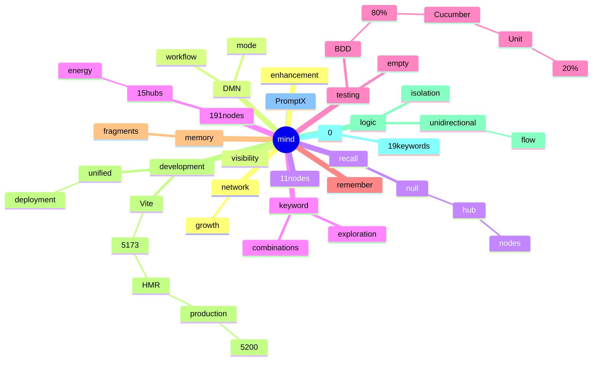

# PromptX Memory Formation Process - Mind Evolution

**Role**: assistant (Executive Secretary)
**Date**: 2025-11-15
**Scenario**: Assisting with Agent project image support feature

---

## Initial State - Before Any Conversation

**Action**: DMN scan to view initial memory network

**Command**:
```javascript
recall(role: "assistant", query: null, mode: "balanced")
```

**Mind Map (25 keywords)**:



**Existing Memory Fragments**: 6 fragments about PromptX system, DMN workflow, recall/remember mechanisms

---

## Round 1 - Exploring PromptX Knowledge

**User Request**: "Help me understand the Agent project architecture"

**My Action**: Recall existing knowledge about PromptX

**Command**:
```javascript
recall(role: "assistant", query: "PromptX", mode: "balanced")
```

**Retrieved Memories**: 6 fragments
- Cognitive cycle testing verification
- DMN mode trigger mechanism
- Network growth from 0 to 19 keywords
- DMN enhancement effect (11 → 191 nodes)
- Multi-round recall success cases

**Mind Map**: Still 25 keywords (no changes yet, only reading)

---

## Round 2 - Exploring Workflow Knowledge

**My Action**: Continue exploring workflow-related memories

**Command**:
```javascript
recall(role: "assistant", query: "workflow memory network", mode: "balanced")
```

**Retrieved Memories**: 6 fragments (similar to Round 1)

**Mind Map**: Still 25 keywords (no changes yet, only reading)

---

## Round 3 - First Remember Operation

**User Context**: Discussed Agent project architecture with monorepo, ClaudeProvider image support, layered architecture

**My Action**: Save new knowledge learned from this conversation

**Command**:
```javascript
remember(role: "assistant", engrams: [
  {
    content: "Agent project uses monorepo structure with pnpm workspaces...",
    schema: "Agent monorepo pnpm workspaces apps packages separated development unified deployment",
    strength: 0.85,
    type: "PATTERN"
  },
  {
    content: "ClaudeProvider implements image support using Anthropic SDK...",
    schema: "ClaudeProvider image support Anthropic SDK content blocks base64 MIME",
    strength: 0.8,
    type: "ATOMIC"
  },
  {
    content: "Project follows layered architecture: api layer forwards to facade...",
    schema: "layered architecture api facade core business logic isolation",
    strength: 0.9,
    type: "PATTERN"
  }
])
```

**New Keywords Added**:
- Agent, monorepo, pnpm, workspaces, apps, packages, separated, development, unified, deployment
- ClaudeProvider, image, support, Anthropic, SDK, content, blocks, base64, MIME
- layered, architecture, api, facade, core, business, logic, isolation

**Mind Map (Estimated ~37 keywords)**:



---

## Round 4 - Second Remember Operation

**User Context**: Discussed development environment (Vite/ports), state management (Component/Store/EventBus), testing strategy (BDD/Unit)

**My Action**: Save new knowledge about development process

**Command**:
```javascript
remember(role: "assistant", engrams: [
  {
    content: "Development uses two processes: Vite dev server on 5173...",
    schema: "development Vite 5173 HMR production 5200 single process API WebSocket",
    strength: 0.85,
    type: "PATTERN"
  },
  {
    content: "Component state management follows strict rule: Components call Store actions...",
    schema: "Component Store EventBus state management business logic unidirectional flow",
    strength: 0.9,
    type: "PATTERN"
  },
  {
    content: "Testing strategy uses BDD 80% for behavior with Cucumber features...",
    schema: "testing BDD 80% Cucumber Unit 20% coverage 70-80%",
    strength: 0.75,
    type: "ATOMIC"
  }
])
```

**New Keywords Added**:
- development, Vite, 5173, HMR, production, 5200, single, process, API, WebSocket
- Component, Store, EventBus, state, management, unidirectional, flow
- testing, BDD, 80%, Cucumber, Unit, 20%, coverage, 70-80%

**Mind Map (50 keywords - Final State)**:



---

## Final Verification - DMN Scan

**My Action**: Verify network growth

**Command**:
```javascript
recall(role: "assistant", query: null, mode: "balanced")
```

**Mind Map (50 keywords - Confirmed)**:


---

## Summary of Mind Evolution

| Step | Action | Keywords Before | Keywords After | Change |
|------|--------|----------------|----------------|--------|
| Initial | DMN scan | 0 | 25 | +25 (existing) |
| Round 1 | Recall "PromptX" | 25 | 25 | 0 (read only) |
| Round 2 | Recall "workflow memory network" | 25 | 25 | 0 (read only) |
| Round 3 | Remember (3 engrams) | 25 | ~37 | +12 |
| Round 4 | Remember (3 engrams) | ~37 | 50 | +13 |
| Final | DMN scan verification | 50 | 50 | 0 (verify) |

**Total Growth**: 25 → 50 keywords (+100%)

**New Domains Added**:
1. Agent project architecture (monorepo, pnpm, workspaces, layered architecture)
2. Image support implementation (ClaudeProvider, Anthropic SDK, base64)
3. Development environment (Vite, ports 5173/5200, HMR)
4. State management pattern (Component, Store, EventBus, unidirectional flow)
5. Testing strategy (BDD 80%, Cucumber, Unit 20%)

**Memory Types Saved**:
- PATTERN: 4 engrams (workflow, architecture, development patterns)
- ATOMIC: 2 engrams (specific implementations, metrics)
- LINK: 0 engrams (not triggered in this session)
